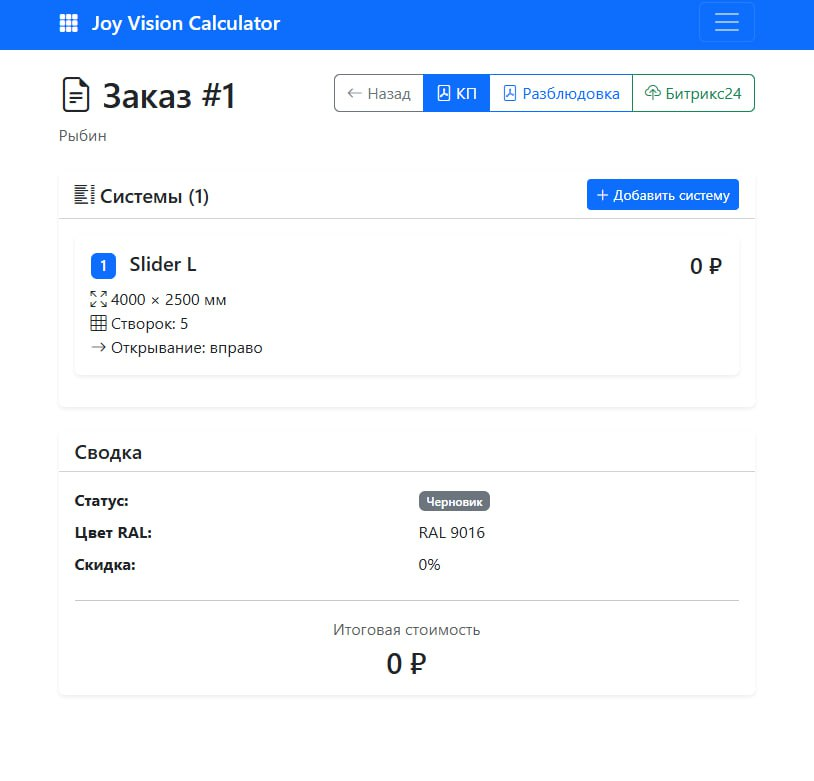
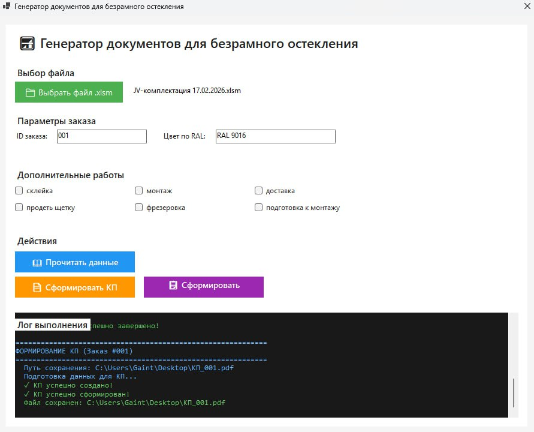

# Joy Vision Calculator

[](LICENSE)
[](https://github.com/CreatmanCEO/joy-vision-calculator/stargazers)
[](https://github.com/CreatmanCEO/joy-vision-calculator/actions/workflows/validate.yml)
[]()
[](https://flask.palletsprojects.com/)

Веб-приложение для расчёта комплектующих систем безрамного остекления, генерации PDF (коммерческое предложение и разблюдовка) и автоматической синхронизации заказов с Битрикс24. Сделано для производителя [Joy Vision](https://joyvision.ru) и заменяет ручной Excel-процесс.

> English version: [README.md](README.md)

## Скриншоты

| Калькулятор | Список заказов |
|---|---|
|  |  |

[Демо-видео — рабочий процесс заказов](docs/demos/orders-flow.mp4) (~1.9 МБ, GitHub проигрывает inline).

## Зачем это нужно

До приложения процесс выглядел так: замерщик снимал размеры, открывал мастер-Excel, копировал формулы, вручную собирал список комплектующих, выгружал PDF и затем отдельно вбивал сделку в Битрикс24. На два окна одного проёма уходило 30–40 минут, а ошибки в спецификации были регулярными.

Приложение сворачивает это в одну форму:

1. Выбрать тип системы, ввести размеры и количество.
2. Калькулятор сам формирует список комплектующих по актуальному прайсу.
3. Один клик → PDF КП + PDF разблюдовки.
4. Один клик → заказ улетает в Битрикс24 как сделка с прикреплёнными документами.

## Как это работает

```
Браузер (Bootstrap-форма)
      │  POST /api/orders
      ▼
Flask-приложение (app.py)
      │
      ├─ modules/calculator/  → расчёт комплектующих по типу системы
      ├─ modules/pricing/     → читает SQLite-прайс
      ├─ modules/pdf/         → ReportLab → КП + разблюдовка
      └─ modules/bitrix/      → REST-вебхук → сделка в Битрикс24
```

Поддерживаемые системы:

- **Slider L** — параллельно-сдвижная
- **Slider X** — усиленная параллельно-сдвижная
- **JV Line** — с парковкой
- **JV Zig-Zag** — гармошка

Архитектурная диаграмма: [`docs/architecture.svg`](docs/architecture.svg).

## Технологический стек

| Слой       | Инструмент                        |
|------------|-----------------------------------|
| Язык       | Python 3.10+                      |
| Веб        | Flask 3.x                         |
| ORM        | SQLAlchemy 2.x + Flask-SQLAlchemy |
| Миграции   | Flask-Migrate (Alembic)           |
| БД         | SQLite (по умолчанию) / PostgreSQL |
| PDF        | ReportLab 4.x                     |
| Excel      | pandas 2.x + openpyxl 3.x         |
| HTTP       | requests 2.31+                    |
| WSGI       | Gunicorn 21+                      |
| Тесты      | pytest + pytest-flask             |
| Фронт      | Jinja2 + Bootstrap                |
| CRM        | Битрикс24 (incoming webhook)      |

## Быстрый старт

### Требования

- Windows 10/11 или Ubuntu 20.04+
- Python 3.10+
- ~500 МБ свободного места

### Установка

**Windows:**
```bat
git clone https://github.com/CreatmanCEO/joy-vision-calculator.git
cd joy-vision-calculator
install.bat
```

**Ubuntu (VPS):**
```bash
git clone https://github.com/CreatmanCEO/joy-vision-calculator.git
cd joy-vision-calculator
chmod +x install.sh
sudo ./install.sh
```

Подробные инструкции:

- [Установка на Windows](INSTALL_WINDOWS.md)
- [Установка на Ubuntu / VPS](INSTALL_UBUNTU.md)
- [Настройка Битрикс24](docs/BITRIX_SETUP.md)
- [Интеграция с Tilda](TILDA_INTEGRATION.md)
- [Инструкция для заказчика](ИНСТРУКЦИЯ_ДЛЯ_ЗАКАЗЧИКА.md)

## Конфигурация

Настройки в `.env` (скопировать из `.env.example`):

```env
SECRET_KEY=                  # секрет Flask — обязательно сменить
BITRIX24_WEBHOOK_URL=        # URL входящего вебхука
BITRIX24_FOLDER_ID=          # ID папки в Битрикс24 для документов
DATABASE_URL=                # sqlite:///data/app.db или postgresql://...
```

## API

После запуска REST-эндпоинты доступны по `http://localhost:5000/api`:

| Метод  | Путь                          | Назначение                      |
|--------|-------------------------------|---------------------------------|
| GET    | `/api/orders`                 | список заказов                  |
| POST   | `/api/orders`                 | создать заказ                   |
| GET    | `/api/orders/{id}`            | получить заказ                  |
| PUT    | `/api/orders/{id}`            | обновить заказ                  |
| DELETE | `/api/orders/{id}`            | удалить заказ                   |
| POST   | `/api/orders/{id}/systems`    | добавить систему к заказу       |
| GET    | `/api/orders/{id}/pdf/kp`     | PDF коммерческого предложения   |
| GET    | `/api/orders/{id}/pdf/spec`   | PDF разблюдовки                 |
| GET    | `/api/prices`                 | список цен                      |
| POST   | `/api/prices/import`          | импорт прайса из Excel          |
| POST   | `/api/bitrix/sync/{id}`       | синхронизация с Битрикс24       |

## Тесты

```bash
pytest tests/ -v
```

## Ограничения

- Один арендатор: нет учётных записей пользователей и разделения по компаниям.
- Логика расчёта заточена под каталог Joy Vision; для другого производителя нужно править `modules/calculator/` и `models/price.py`.
- Интеграция с Битрикс24 идёт через входящий вебхук (без OAuth) — URL это долгоживущий секрет.
- Шаблоны PDF только на русском.
- Авто-тесты только бэкенд-овые (pytest); фронт не покрыт.
- По умолчанию SQLite. Под параллельную запись — переключить через `DATABASE_URL` на PostgreSQL.

## Лицензия

Проприетарное ПО. Исходники опубликованы только в портфолио-целях — см. [LICENSE](LICENSE). Любое коммерческое использование требует письменного разрешения.

## Автор

**Николай Подоляк** — full-stack инженер.

- GitHub: [@CreatmanCEO](https://github.com/CreatmanCEO)
- Habr: [creatman](https://habr.com/ru/users/creatman/)
- dev.to: [@creatman](https://dev.to/creatman)
- Telegram: [@Creatman_it](https://t.me/Creatman_it)
- Сайт: [creatman.site](https://creatman.site)
